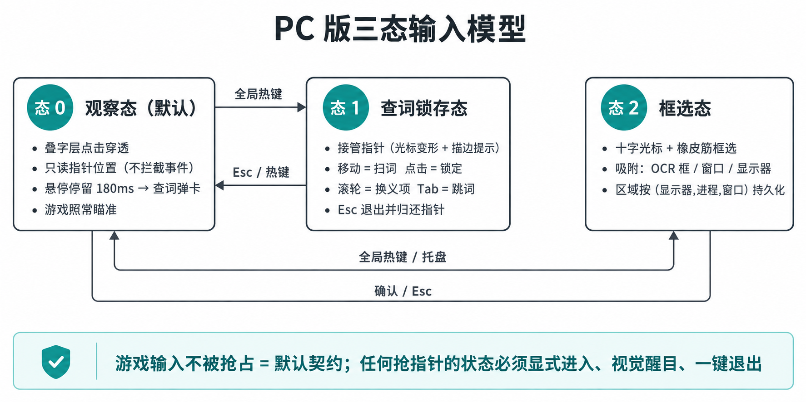
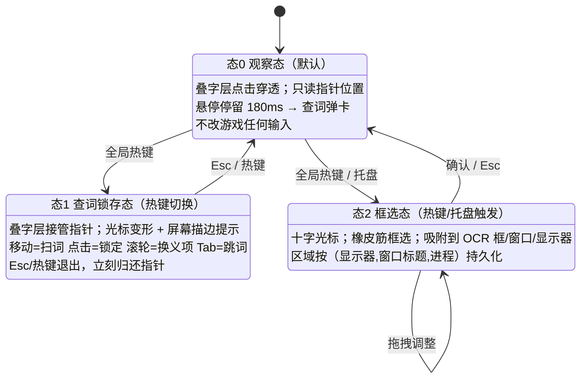

# PlayTranslate PC 移植设计（v0.2）

> 日期：2026年9月22日
> 上游基线：`dominostars/playtranslate` @ `cfaaca6`（v3.2.0，Android，GPL-3.0）
> 本文取代 v0.1。v0.1 建立了平台矩阵、模型与语音专题、交互范式重设计；v0.2 定下三项结构性决策，并补齐分发与治理。

## v0.2 相对 v0.1 的变更

| # | 变更 | 位置 |
|---|---|---|
| 1 | 应用自身的 UI 层（设置 / 词卡 / 工作区 / Anki 复习 / 历史 / 结果页）**改用 Web 重写**，按上游信息架构一一对应；叠字层保持原生 | §7.1–§7.2 |
| 2 | 移动端强绑定的「拖动 / 按住 / 长按」手势**全部废除**，改为**可自定义的全局快捷键体系**（含鼠标侧键、HOLD/TAP 两种语义、按应用分档） | §5.7 |
| 3 | 悬浮图标**改为系统托盘图标**（默认开启、可关闭）；悬浮图标降级为触屏 PC 的可选模式 | §5.8 |
| 4 | 分发格式定为 **Windows MSI / macOS DMG / Linux deb + rpm + Flatpak** | §7.5 |
| 5 | 新增仓库治理、许可与对外说明（fork 声明、商标硬约束、不再维护声明） | §12 |

---

## 0. 一句话结论

这个项目搬到 PC 上，**难的不是"截屏 + OCR"，而是三件事**：

1. **指针归属**——手机上触控由系统按窗口分发，游戏和应用各拿各的；PC 上鼠标是**独占资源**，游戏要拿它瞄准，叠字层要拿它查词。整套交互必须围绕"默认不抢指针"重新设计（§5）。
2. **离线兜底层被抽掉**——`ML Kit` 是 22/25 种源语言的 OCR 兜底，也是离线翻译的保底后端，两者**都无法移植**。兜底层必须用已经在仓库里的 MNN / Bergamot 重建（§3）。
3. **画到别人窗口上面这件事，四个平台有四种做法，其中 GNOME Wayland 基本做不到**（§6）。

好消息：**代码库的可复用度比看起来高得多**。491 个 Kotlin 文件里 **125 个完全不引用任何 Android API**，另有 20 个只用到 `android.util.Log`；原生层（MNN / slimt）本来就是跨平台 C++，**JNI 层在桌面 JVM 上几乎可以原样保留**。

---

## 1. 目标平台矩阵

「PC」= Windows + macOS + Linux，且 Linux 内部 **X11 与 Wayland 必须分开讨论**（能力差异比 Windows 与 macOS 之间还大）。

| 平台 | 会话/合成 | 叠字可行性 | 截屏方案 | 全局热键 | 音频回环 | 目标等级 |
|---|---|---|---|---|---|---|
| Windows 10 1809+ / 11 | DWM 合成 | ✅ 分层窗口 + 点击穿透 | Windows.Graphics.Capture / DXGI Desktop Duplication | Raw Input（无需钩子）或 WH_KEYBOARD_LL | WASAPI loopback（全系统 / Win10 2004+ 可按进程） | **P0 一等公民** |
| macOS 13+ | Quartz 合成 | ✅ `NSWindow.level` + `ignoresMouseEvents` | ScreenCaptureKit（需"屏幕录制"授权） | CGEventTap（需"辅助功能"授权）或 Carbon | ScreenCaptureKit `capturesAudio`；旧系统需 BlackHole 虚拟声卡 | **P0 一等公民** |
| Linux / KDE Plasma 6（X11） | X11 合成器 | ✅ override-redirect + XShape 输入区置空 | XComposite + XShm | XInput2 / XRecord | PulseAudio `.monitor` | **P0** |
| Linux / KDE Plasma 6（Wayland） | KWin + layer-shell | ✅ KWin 实现 `wlr-layer-shell`（**需实测确认**） | xdg-desktop-portal ScreenCast（PipeWire） | xdg-desktop-portal GlobalShortcuts（**只给"激活"，无 key-up，HOLD 语义要退化**） | PipeWire monitor 源 | **P0（KDE 为主要 Linux 目标）** |
| Linux / XFCE | X11 合成器 | ✅ 同 KDE-X11 | 同上 | XInput2 / XRecord | PulseAudio `.monitor` | **P1**（Xfce 4.20 的 Wayland 会话仍在预览阶段，按 X11 处理） |
| Linux / GNOME（X11 会话） | Mutter/X11 | ✅ | 同上 | XInput2 | PulseAudio `.monitor` | **P1** |
| Linux / GNOME（Wayland 会话） | Mutter | ❌ **无全局叠字协议**（Mutter 不实现 `wlr-layer-shell`，需写 GNOME Shell 扩展） | portal ScreenCast ✅ | GlobalShortcuts portal（版本支持需实测） | PipeWire ✅ | **P2：功能降级为"侧栏模式"**，或引导用户切 X11 会话 |

**设计含义**：Linux 上必须准备**两套呈现后端**——`OverlayBackend`（X11 / KDE-Wayland，叠在游戏上）与 `PanelBackend`（任何环境都能用的独立/侧栏窗口，GNOME-Wayland 走这条）。这不是妥协，而是把上游的 `IN_APP_ONLY` 模式（`OverlayFlavor.IN_APP_ONLY`）提升为 PC 的一等模式——上游只在"单显示器"时用它，PC 上它是 Wayland-GNOME 的唯一出路。

> ⚠️ 表中标注"需实测"的条目（KWin 的 layer-shell 行为、GlobalShortcuts portal 在各 DE 的实现版本、PipeWire 按应用捕获）属于**外部生态事实**，本次未能联网核实，进入 P0 前必须各写一个 30 行的最小验证程序跑一遍。**不要基于假设开工。**

---

## 2. 移植分级：可复用 / 换实现 / 重新设计

### 2.1 量化基线（实测，非估算）

对 `app/src/main/java/com/playtranslate/` 全部 491 个 Kotlin 文件做依赖扫描：

| 类别 | 文件数 | 占比 | 含义 |
|---|---|---|---|
| 完全不引用 Android API | **125** | 25.5% | 纯 Kotlin/JVM，**可直接编进桌面模块** |
| 只用 `android.util.Log` / 注解 | 20 | 4.1% | 加一个 shim 即可 |
| 真正依赖 Android API | 346 | 70.4% | 需替换实现或重写 |
| （其中 `ui/` 包） | 171 | — | 63,988 行，**几乎全部作废**（Android View 体系） |

**核心逻辑的几何/位图渗透量极小**：`ocr/ language/ dictionary/ yomitan/ translation/ model/ audio/` 这几个"看起来最核心"的包里，`android.graphics` 只出现 **Rect × 17、Bitmap × 8、PointF × 5**。也就是说，把核心逻辑抽成平台无关模块的成本，主要集中在这 3 个类型的替换上（`PtRect` / `PtImage` / `PtPointF`），不是"处处都要改"。

按包统计的**纯 JVM 文件数**（可直接复用）：

| 包 | 纯 JVM 文件 | 典型内容 |
|---|---|---|
| `language/` | 21 | `Language.kt`(638)、`MaximalMatchThaiSegmenter`(202)、`SentenceAnnotation`(182)、`PinyinFormatter`、`ThaiCharacterCluster` |
| `translation/` | 18 | `DeepLBackend`(369)、`Capabilities`(212)、`PartitionedDispatch`、`LlmPromptTemplates`、`GoDuration`、`TimeFormat` |
| `yomitan/` | 9 | `TermEntry`(204)、`TermGlossary`(233)、`TermMerge`、`FreqData`、`KanjiBankEntry` |
| `ocr/` | 9 | `CharClassCoverage`(283)、`OcrCapabilities`、`RecognizedTextNormalizer`、`GroupingStrategy` |
| `dictionary/` | 6 | `Deinflector`(308)、`JapaneseInflectionAnalyzer`、`PrefixSearch`、`Mora` |
| `camera/tracker/` | 3 | **`TrackerEngine`(554)**、`TrackerConfig`(218)——纯 Kotlin 跟踪算法 |
| `model/` | 5 | `DictionaryModels`(498)、`PosVocabulary`(176) |
| `audio/` | 7 | VAD 门控、静音门、响度、波形裁剪逻辑 |
| 顶层 | 15 | `CaptureSession`(243)、`PinholeCalibration`(257)、`OutsideBlockGrid`(201)、`SentenceBoundary` |
| 其他 | 12 | `net/`、`translationlog/`、`processtext/` 的一部分 |

**测试资产**：286 个单测文件 / 48,382 行；其中 **150 个是纯 JVM 测试**（可随核心逻辑一起搬走），**135 个依赖 Robolectric**（Android 专用，需要改写成桌面测试或保留在 Android 侧做回归）。

### 2.2 逐子系统分级

| 子系统 | 上游实现 | 分级 | PC 方案 |
|---|---|---|---|
| 词典包格式与构建 | `dict.sqlite` + `manifest.json`，`scripts/*.py` 12.5k 行 | **✅ 原样复用** | 构建脚本与包格式零改动 |
| 源语言引擎（分词/词形） | Sudachi、HanLP、KOMORAN、Lucene Snowball、自研 newmm 泰语、CAMeL 阿拉伯语 | **✅ 复用**（纯 JVM 库） | 全是 JVM 库，桌面直接依赖；注意 HanLP/Sudachi 的模型体积 |
| Yomitan 词典 | 自研解析 + SQLite | **✅ 复用** | 顺带把导入路径从 SAF 改成文件系统目录，PC 上体验更好 |
| 翻译后端（在线） | Lingva/DeepL/OpenAI/Gemini/DeepSeek/Mistral/Groq/OpenRouter/Claude | **✅ 复用** | 纯 HTTP，仅需复核 `CustomEndpointPolicy` 与证书处理 |
| 瀑布流与缓存 | `TranslationBackendRegistry`、`TranslationCache`、`CooldownState` | **✅ 复用** | 仅"兜底后端"的实体变了（见 §3.5） |
| Anki 导出 | AnkiDroid ContentProvider | 🔁 **换实现** | → **AnkiConnect**（localhost:8765）；`AnkiCardTypeMapper` / `AnkiSendPipeline` / 卡模板 CSS 逻辑基本原样保留 |
| 秘密存储 | AndroidKeyStore + AES-GCM | 🔁 换实现 | Windows DPAPI / macOS Keychain / libsecret |
| 自动更新 | GitHub Releases + APK 安装 | 🔁 换实现 | 三平台各自的更新通道（§7.5） |
| 屏幕采集 | 无障碍 `takeScreenshot` / MediaProjection | 🔁 **换实现** | 四平台四种 API（§1） |
| 叠字层 | `OverlayHost`（`TYPE_ACCESSIBILITY_OVERLAY` / `TYPE_APPLICATION_OVERLAY`） | 🔁 **换实现** | 分层窗口 + 点击穿透（§6） |
| 输入/热键 | 无障碍 `onKeyEvent` + 手柄 KeyEvent | 🔁 **换实现** | 全局热键 + 设备级输入源（§5.5） |
| OCR 引擎 | ML Kit（兜底）+ MNN（Meiki/MangaOCR/Paddle） | 🔁 **换实现（ML Kit 部分）** | ML Kit 无桌面版；MNN 部分**原样复用**（§3.6） |
| OCR 版面分析 | `LayoutAnalyzer`(2446)、`DeskewGeometry`、`FlowGraphStrategy`、`RubyFilter` | ⚠️ **轻改造** | 算法全部保留，替换 `android.graphics.Rect` 等 3 个类型 |
| 本地 LLM | MNN-LLM（`mnn_chat.cpp` + `MnnChatImpl`） | ⚠️ **重建构建** | C++ 保留，桌面编译 + 后端选择（§3.2/3.3） |
| 离线 NMT | Bergamot / slimt（`bergamot_jni.cpp`） | ⚠️ **重建构建（更简单）** | slimt 本就是桌面库，桌面构建比 Android 容易 |
| TTS | `android.speech.tts.TextToSpeech` | 🔁 **换实现** | SAPI/OneCore、AVSpeechSynthesizer、speech-dispatcher/Piper（§4） |
| 游戏音频采集 | `AudioPlaybackCapture`（跟随 MediaProjection） | 🔁 **换实现** | WASAPI loopback / SCK audio / PipeWire monitor（§4.3） |
| VAD / 波形 / 静音门 | `SileroVad`(.mnn)、`SilenceGate`、`VoiceLineSnap`、`Loudness` | **✅ 复用** | Silero 是 MNN 模型，逻辑纯 Kotlin |
| 相机翻译 | CameraX + ORB/LK 跟踪（OpenCV） | 🔁 换实现 + ⚠️ 价值重估 | OpenCV 有桌面版；但 PC 上"相机"的意义变了（§8） |
| UI（全部） | Android View，171 文件 / 64k 行 | ❌ **重写** | 桌面原生 UI（Compose Desktop / JavaFX / Qt），只复用其**信息架构与文案** |
| 权限/引导流程 | 无障碍 + 悬浮窗 + MediaProjection 三件套 | 🔁 重设计 | 屏幕录制授权、辅助功能授权、portal 授权、独占全屏检测提示 |

---

## 3. 翻译模型移植专题

### 3.1 现有模型栈盘点（来自 `langpack_catalog.json`，141 个包）

| 类型 | 数量 | 体积 | 内容 |
|---|---|---|---|
| 源语言词典 | 25 | ~373 MB | ja 99.9 MB（JMdict + KANJIDIC2 + SudachiDict + Tatoeba） |
| 目标语释义 | 58 | ~1.38 GB | 单包覆盖全部源语言 → 某目标语 |
| 离线引擎 | 50 | **~8.53 GB** | 5 个 MNN LLM（最大 Gemma 4 E2B 2.89 GB）+ 45 个 Bergamot 方向对（每个 36–55 MB） |
| OCR 模型 | 8 | ~173 MB | Meiki-ja 46.7 MB、manga-ocr-ja 70.5 MB、6 个 Paddle 识别包 8–13 MB |

### 3.2 MNN 层：C++ 保留，只换构建

`:mnn` 模块的两个 C++ 文件分工清楚：

- `mnn_chat.cpp` — LLM 自回归推理（`Llm` / `LlmContext` / `LlmStatus`），单例 + KV cache 回卷；
- `mnn_infer.cpp` — Session API 的通用推理（CNN/CRNN，单输入单输出 + 多输入多输出），**OCR 模型全靠它**。

**关键判断：MNN 本身就是跨平台 C++ 推理框架（x86 AVX2/AVX512、ARM、以及 OpenCL/Vulkan/CUDA/Metal 后端）。** 桌面化要做的是：

1. 用桌面 CMake 工具链重建 MNN（x86_64 + `MNN_AVX2=ON`，可选 `MNN_CUDA=ON` / `MNN_METAL=ON`）；
2. **保留 `mnn_chat.cpp` / `mnn_infer.cpp` 与 `MnnChatImpl` / `MnnInterpreter` 的 JNI 签名不变**——JNI 在桌面 JVM 上完全可用；
3. 移除 Android 专有件：`dalvik.annotation.optimization.FastNative`、`applicationInfo.nativeLibraryDir`、`BuildConfig` 的 ABI 判定、`MmapWeightCache` 的 Android 路径。

`MnnInterpreter` 的注释已经写明它"deliberately minimal and OCR-agnostic"——这个接缝就是桌面移植的落脚点。

> 顺带修一个上游的历史包袱：`:mnn` 的 `abiFilters` 只有 `arm64-v8a`，`OnDeviceLlmBackend.supportsRequiredAbi()` 靠运行时硬件门来隐藏 32 位设备上的后端行。桌面版这个门应该改成**能力探测**（AVX2 是否可用、显存是否够、可用内存），而不是 ABI 白名单——PC 上"能不能跑"是连续谱，不是二元。

### 3.3 LLM 层：保留 MNN-LLM，还是重新引入 llama.cpp？

代码里留了线索：`MnnChatImpl` 的类注释写着 *"Mirrors `:llama`'s `InferenceEngineImpl` shape"*，`OnDeviceLlmBackend` 里提到 *"after the `:llama` strip"*——**上游曾经有过一个 llama.cpp 后端，后来被剥离了**。而 `InferenceEngine` 接口、`ModelHelper`、`LlmPromptTemplates`(370)、`PromptStyle`、`LlmOutputCleaner`、`LlmBatchPrompt` 这一整套**已经是引擎无关的**。

三条路线：

| 路线 | 优点 | 缺点 | 建议 |
|---|---|---|---|
| A. MNN-LLM 桌面化 | 改动最小，模型包直接复用（.mnn），零转换 | x86 上 MNN 的 LLM 路径不如 llama.cpp 成熟；无 CUDA/Metal 的成熟 LLM 后端 | 作为**保底**实现 |
| B. 重新引入 llama.cpp / GGUF | x86 AVX512、CUDA、Metal、Vulkan 全面且活跃；社区生态巨大；量化格式（Q4_K_M 等）选择多 | 需要把 5 个 MNN 模型重新转成 GGUF（一次性成本，`convert_hf_to_gguf.py` 现成） | **推荐为主路径**，`:llama` 的历史接缝正好还在 |
| C. 复用上游的 MNN 包 + 新增 GGUF 后端并存 | 用户已下载的包不作废 | 两套运行时，APK/安装包体积和测试矩阵翻倍 | 过渡期方案 |

**结论**：桌面版应把 `InferenceEngine` 的第二个实现（GGUF）作为首选，MNN-LLM 作为"复用已有包"的兼容路径。这也直接解决 §3.7 的 PC 独占机会。

### 3.4 Bergamot / slimt：桌面比 Android 更容易

`slimt` 是 Firefox Translations 的引擎，本来就是为桌面 x86 设计的（int8 走 gemmology、float 走 ruy，都是 x86/ARM 通用路径）。上游为 Android 打的那堆补丁（`xsimd` 回退到 11.2.0、`-Werror → -Wno-error`、`SLIMT_USE_INTERNAL_PCRE2`）在桌面上大多可以还原成上游默认值。`bergamot_jni.cpp` 的 JNI 签名（handle 用 `jlong`、fail-soft 返回 0）**不需要改**。

45 个 Bergamot 方向对（每个 36–55 MB）是桌面版的**离线翻译主力**：比 8.5 GB 的 LLM 层轻一个数量级，且 CPU 上快得多。建议 PC 默认离线路径 = Bergamot 覆盖方向 + 其余方向走 ONNX Runtime（opus-mt / NLLB 蒸馏版）。

### 3.5 ML Kit 无法移植 → 兜底层重建（架构后果）

这是全篇**最重要的架构结论**。ML Kit 在项目里同时承担两个"保底"角色：

1. **OCR 兜底**：`OcrEngineRegistry.engineFor()` 里，用户选的引擎（Meiki/Paddle）不在就 fall through 到 `SourceLanguageProfile.mlKitFloor`，再不行返回 `EmptyOcrEngine`。25 种源语言里 **22 种**的 floor 是 ML Kit（`MLKitLatin` / `MLKitJapanese` / `MLKitChinese` / `MLKitKorean` / `MLKitDevanagari`）。
2. **翻译兜底**：`isDegradedFallback` 标记的就是 ML Kit——瀑布流最后的"保证能出结果"。

ML Kit 没有桌面版。**但好消息是替换件已经在仓库里**：

| ML Kit 家族 | 覆盖语言 | 现有 MNN 替换件（目录里已有） |
|---|---|---|
| Latin | en/es/fr/de/it/pt/nl/sv/da/no/fi/ca/id/tr/hu/ro/vi/pl 等 | `paddle-rec-unified`（10.7 MB） |
| Japanese | ja | `meiki-ja`（46.7 MB）+ `manga-ocr-ja`（70.5 MB） |
| Chinese | zh / zh-Hant | `paddle-rec-unified`（需实测 CJK 质量） |
| Korean | ko | `paddle-rec-korean`（13.4 MB） |
| Devanagari | hi | `paddle-rec-devanagari`（7.9 MB，上游标注"dormant"） |
| （ML Kit 无） | ru / ar / th | `paddle-rec-cyrillic` / `-arabic` / `-thai` ——**这三种语言本来就是纯 MNN 路径，零移植成本** |

**所以 OCR 的移植工作量比想象中小**：ML Kit 适配层本身只有 2 个文件（`MlKitOcr.kt` 57 行 + `MlKitTextMapper.kt` 172 行），删掉后把 `mlKitFloor` 改成对应的 Paddle/Meiki 包即可。**主要风险是质量而非工程量**——`paddle-rec-unified` 对 CJK 和拉丁混排的识别精度必须逐一实测（上游有 20 个设备端 golden-set 测试 + `paddle-rec-unified` 的 A/B 报告脚本，可复用）。

翻译侧的后果更结构性：**"离线永远有结果"这个承诺在 PC 上要重新定义**。建议新的瀑布流尾部：

```
用户选定后端（在线 LLM / 本地 LLM / Bergamot）
  → Bergamot（离线，覆盖方向）
  → ONNX Runtime NMT（离线，覆盖其余方向）
  → [不再有"永远能出结果"的兜底] → 显式告知用户"该语言对无离线模型"
```

`isDegradedFallback` 的语义要跟着改：它现在等于"ML Kit 兜底"这一件事，未来要变成"当前结果来自保底层，故不入缓存"的能力标记（`Capabilities.kt` 的侧接口模式正好支持这种扩展）。

### 3.6 OCR 模型无需重新转换

`MeikiSession` / `MangaOcrSession` / `PaddleOcrSession` 加载的是 **`.mnn` 格式**，由 `scripts/ocr-model-conversion/` 从 ONNX 转换而来。桌面 MNN 读同样的文件 → **OCR 模型包 173 MB 一个字节都不用重转**。

唯一需要留意的是预处理里的 OpenCV 调用（`DbNet.kt` 的 findContours/minAreaRect、`PaddleOcrSession` 的 warpPerspective、Meiki 的 letterbox）：OpenCV 官方提供 Windows/macOS/Linux 的 Java 绑定，接口一致。另外 `MeikiSession` 注释里提到"CRITICAL: `orig_target_sizes` MUST be int32 `[W,H]`"——这类**数值精度/字节序的坑在 x86 上要重跑一遍验证**，ARM 上验证过的结论不能直接继承。

### 3.7 PC 独占机会：本地推理服务器作为后端

PC 上用户可以自己跑 Ollama / LM Studio / llama-server。把"OpenAI 兼容端点"（仓库已有 `OpenAiBackend`(801) + `OnlineServiceStore`(247) + `CustomEndpointPolicy`(60)）指向 `http://127.0.0.1:11434/v1` 就能白嫖本地大模型——**质量高于内置 2B 模型、显存占用由用户自理、我们零下载体积**。这应该是 PC 版设置页的一等选项，而不是藏在"自定义端点"里。

同理，AnkiConnect、Yomitan 目录、Textractor 之类的 PC 生态工具都可以互操作（§8）。

### 3.8 模型分发策略

移动端受应用商店体积限制，才需要 141 个包 / 10.5 GB 的按需下载。PC 上要反过来设计：

- **内置**（安装包内）：OCR 模型全部 173 MB + 2–3 个 Bergamot 方向对（约 120 MB）→ 装完即离线可用；
- **按需下载**：目标语释义包（用户选目标语言时下，50–100 MB 量级）；
- **可选**：LLM 层（2.9 GB 的 Gemma 4 E2B 之类）——**默认不下载**，引导用本地服务器（§3.7）或下载小模型（Qwen 1.5B 728 MB）；
- 下载器逻辑（`LanguagePackDownloader`(224) + `PackIntegrity`(125) + `OnDeviceLlmDownloader`(733) + `OfflineModelReclaimer`(199)）**大部分可复用**，需要替换的是 `StatFs`/`ConnectivityManager`/`ActivityManager` 的等价物。

---

## 4. 语音引擎移植专题

### 4.1 TTS 输出：一个接口，三个后端

上游 `TtsEngine.kt`(433) 是 `TextToSpeech` 的缓存包装，处理两件事：**引擎换绑检测**（系统默认引擎变了就重建）和**语言不支持判定**（"unsupported"要重建一次再确认，避免把死绑定误判成不支持）。这套**缓存与重试语义完全通用**，只有引擎本身要换。

建议抽象：

```kotlin
interface TtsBackend {
    fun voicesFor(lang: String): List<TtsVoice>          // 语言 → 可用音色
    suspend fun speak(text: String, voice: TtsVoice?, utteranceId: String): SpeakResult
    suspend fun synthesizeToFile(text: String, voice: TtsVoice?, out: File): SpeakResult  // Anki 要 WAV
    fun stop()
}
```

| 平台 | 后端 | 备注 |
|---|---|---|
| Windows | SAPI5（`ISpVoice`）/ OneCore（WinRT `Windows.Media.SpeechSynthesis`） | ⚠️ **经典坑**：SAPI 有 32/64 位两套注册表视图，同一台机器枚举出的音色可能不同；OneCore 与 SAPI5 音色集也不一致。`TtsVoiceLabels`(85) 的"按语言列出音色"逻辑要按这两套合并去重 |
| macOS | `AVSpeechSynthesizer` | 有 standard/enhanced/premium 三档音色；`write(_:toBufferCallback:)` 可直接合成到内存/文件，满足 Anki 需求 |
| Linux | speech-dispatcher（DE 无关，KDE/GNOME/XFCE 都可用）+ espeak-ng | 音色枚举质量参差；**建议另打包 Piper 作为"内置引擎"** |

**建议**：把 **Piper**（离线神经 TTS，MIT，有 ja/zh/en 等多语言音色，原生输出 WAV）作为三平台统一的内置语音引擎，系统 TTS 作为"用你系统里的声音"选项。理由：

1. `audio/sources/TtsAudioSource.kt`(87) 需要的是**能落盘的音频文件**（Anki 卡片附件），Piper 直接输出 WAV，而 Windows SAPI 要绕 `SPBindToFile`、macOS 要绕 buffer callback、Linux 的 speech-dispatcher 干脆不给你文件；
2. 发音一致性——同一个词在"Speak 芯片"和"Anki 卡片音频"里听起来应该一样，跨平台也应该一样；
3. 上游的 `TtsWordText`(20) / `TtsVoiceLabels`(85) 逻辑可复用，只是数据源从 `TextToSpeech.voices` 换成 Piper 音色表 + 系统音色表。

### 4.2 语音识别（ASR）：PC 独占的补充路径

上游**没有** ASR（游戏有字幕文本，用不上）。但 PC 上有一类场景上游覆盖不到：**没有字幕的语音对话**（老游戏、动作游戏、语音剧情）。用 whisper.cpp（CPU/GPU 皆可，量化模型 75 MB–1.5 GB）就能补上。属于 P2 机会项，不进首版。

### 4.3 游戏音频采集（Anki 卡片要带"游戏原声"）

上游 `GameAudioRecorder.kt`(520) 用 `AudioPlaybackCapture` 挂在 MediaProjection 会话上，靠 **usage 匹配 + `excludeUid`** 把自己排除掉，跑一个 180 秒 / 44.1 kHz / PCM16 ≈ 15.9 MB 的环形缓冲，配 `SilenceGate`（连续 2 秒精确零值丢弃）和 Silero VAD。

各平台等价物：

| 平台 | API | 关键差异 |
|---|---|---|
| Windows | WASAPI loopback（默认渲染端点，全系统混音）；Win10 2004+ 支持**按进程树**捕获 | 按进程捕获**从构造上就解决了"排除自己"**的问题，比 Android 的 usage 匹配干净得多 |
| macOS 13+ | ScreenCaptureKit `capturesAudio`（可指定 app 或全系统） | 与屏幕录制同一授权；旧系统需要用户自装 BlackHole 虚拟声卡（摩擦大，建议直接要求 13+） |
| Linux | PipeWire monitor 源 / PulseAudio `.monitor` | 按应用捕获需 `pw-record --target=<node>`（**需实测**）；"排除自己"通过不选自己的 node 实现 |

**可复用部分**：环形缓冲的裁剪/快照逻辑（`GameAudioSnapshot`(81)）、`VoiceLineSnap`(186)、`SilenceGate`(71)、`Loudness`(103)、`RecordingPlayer`(240)、`AudioSelection`(179)，以及 **Silero VAD 模型**（`silero_vad_16k.mnn`，桌面 MNN 直接读）。需要重写的只有"往缓冲区里灌 PCM"的那一层（`GameAudioGate` 的状态机逻辑保留）。

另外 `audio/sources/CommonsClient.kt`(263)（Tatoeba/Commons 例句音频）是纯 HTTP，原样可用。

---

## 5. 交互范式重设计（核心）

### 5.1 为什么触控模型不能平移到 PC

上游的交互建立在三个**手机上成立、PC 上不成立**的前提：

| # | 移动端前提 | PC 上的现实 |
|---|---|---|
| 1 | **触控点由系统按窗口分发**——手指按在悬浮窗上，事件给应用；按在游戏画面上，事件给游戏。应用能"只拿自己要的那部分触控" | **鼠标是单一独占指针**。叠字层要么接收全部指针事件（游戏没法瞄准），要么一个都不接收（没法悬停查词）。**没有"只拿一部分"的中间态**——除非应用主动去"只读不拿" |
| 2 | **手指是绝对的、多点的、随触随走的**——"把放大镜拖到那个词上"是个连续采样动作，且手指天然遮挡，所以需要放大镜 | **指针是相对的、单点的、常驻的**。悬停（不按键）就是天然的位置采样，**根本不需要"拖"这个动作**；同时"指针遮挡文字"这个理由消失了——**放大镜在 PC 上失去存在理由** |
| 3 | **应用可以自己申请系统级能力**（无障碍服务 / 悬浮窗权限 / MediaProjection），授权模型是"应用 ↔ 用户" | PC 上是**"应用 ↔ 用户 ↔ 游戏/反作弊"**三方关系。注入、钩子、全局输入监听会被反作弊视为威胁；很多能力要 OS 级授权（macOS 的 TCC、Linux 的 portal），授权流程不在应用掌控内 |

**一句话**：手机版的核心交互资产是"**一个能接收触控的悬浮窗口**"；PC 版的核心交互资产必须是"**一个默认不接收任何输入的观察者**"。

### 5.2 三态输入模型（建议的答案）

把上游的"拖动/按住/点击"三手势，替换成三个**显式的输入态**，态与态之间由用户明确切换，而不是靠手势语义隐式区分。

> **触发方式一律由 §5.7 的快捷键体系承担**——上游的拖动手势不进入 PC 版。态 2 里出现的"拖拽"是 PC 标准的**框选**动作（按下—拖—松开），与移动端"把悬浮图标拖到词上"不是一回事，且另配方向键微调供键盘优先模式使用。





**态 0 观察态**——这是 PC 版最重要的创新点，对应上游 `DragLookupController`(1641) 的"拖动 + 命中测试"：

- 叠字层窗口**点击穿透**（Windows `WS_EX_TRANSPARENT` / macOS `ignoresMouseEvents=true` / X11 `XShape` 输入区置空）；
- 应用**只读指针位置**，不拦截任何事件：Windows `GetCursorPos` 轮询（30–60 Hz 足够）、macOS `NSEvent.mouseLocation`、X11 `XQueryPointer`；
- 指针在某个 OCR box 上停留超过阈值（180 ms 建议值，可配）→ 弹出词卡（复用 `WordLookupPopup` / `MagnifierLens` 的**内容布局**，去掉放大镜部分）；
- 上游"拖动开始时全屏截图 + OCR 一次 + 缓存 box + 命中测试"的机制**完全保留**——只是触发源从"手指按下"变成"指针进入区域"，命中测试代码几乎不用改。

> **Wayland 的硬伤**：Wayland 下没有全局指针位置查询（`wl_pointer` 需要 surface 有焦点）。**态 0 在 GNOME/KDE Wayland 上不可用**，只能退化为态 1 锁存。这是必须在文档和 UI 里对用户明说的功能差异——Linux 用户应该被引导到 X11 会话（KDE 下代价很小），或者接受"必须按热键才能查词"。

**态 1 查词锁存态**——PC 上"拖动查词"的正确形态：

| 输入 | 动作 | 对应上游 |
|---|---|---|
| 移动指针 | 镜头/高亮跟随，实时命中 OCR box | 拖动中的命中测试 |
| 单击 | 锁定当前词，打开词卡 | 松手 → `WordLookupPopup` |
| 滚轮 | 在多个义项/POS 之间切换 | 手机上的"拆分义项"页面 |
| Tab / Shift+Tab | 按阅读顺序跳到下一个/上一个词 | 无（PC 新增，键盘优势） |
| 方向键 | 跳到几何相邻的 box | 无（PC 新增） |
| Enter | 送 Anki | Anki 芯片 |
| Space | 朗读 | Speak 芯片 |
| Esc | 退出锁存，归还指针 | 松手 |

**关键**：进入锁存态必须有**强视觉提示**（光标形状改变 + 屏幕边缘描边 + 托盘图标变色），因为此刻用户正在"从游戏手里抢走鼠标"。上游的 `EdgeIndicator`(693)（捕获时在屏幕边缘画环）视觉语言可以直接复用在这里。

**态 2 框选态**——替代上游的"拖动定义区域"（`RegionPickerSheet`(615)）：

- 十字光标 + 橡皮筋；**吸附**到 OCR 检测框、窗口边界、显示器边界（三个吸附层级，Tab 循环）；
- 上游的 `RegionEntry`（fraction of screen）表达要升级为**双坐标**：`显示器相对 + 窗口相对`，因为 PC 上游戏窗口会被移动/缩放/换显示器；
- 持久化键从"显示器 id"升级为"（显示器, 进程名, 窗口标题正则）"——上游的 `Prefs.selectedRegionIdForDisplay` 结构可以直接扩展。

### 5.3 逐个功能的交互重设计

| # | 上游功能（触控） | 上游实现 | PC 重设计 |
|---|---|---|---|
| 1 | 悬浮图标（1/4 圆贴边，拖动/按住/点击） | `FloatingOverlayIcon`(826) + `IconGestureBindings` | **替换为系统托盘图标**（§5.8，默认开启、可关闭）。PC 有托盘与全局热键，屏幕上常驻图标在游戏里纯属干扰。**但保留为可选模式**——触屏 PC 与 Windows 游戏掌机（ROG Ally、Legion Go、AYANEO）上它依然是最自然的形态，而这类设备正是 PC 游戏翻译的真实用户群。`IconAction` 的候选集与 `quickMenuReachable` 的约束逻辑原样复用 |
| 2 | 快速菜单 | `FloatingIconMenu`(1596) | **托盘右键菜单**（PC 主入口）+ 全局热键唤出的屏幕菜单（GNOME 无托盘时的唯一入口，§5.8）。动作集合原样保留 |
| 3 | 放大镜（拖动时跟随手指，看被手挡住的字） | `MagnifierLens`(3387) | **删除放大镜本身**（PC 上字不会被挡、且屏幕分辨率高）；保留其**卡片布局与信息层级**（词/读音/义项/芯片）。新增：悬停时给 OCR box 描边高亮 |
| 4 | 拖到词上查词 | `DragLookupController`(1641) | 态 0 悬停停留 / 态 1 锁存扫描（§5.2）。**命中测试与词典查询链路原样复用** |
| 5 | 按住预览译文（hold-to-preview） | `HotkeyDecision` + `IconGestureBindings.HoldAction` | 全局热键按住。⚠️ **Wayland 上拿不到 key-up**，HOLD 语义要退化为"按一次显示 / 再按一次隐藏"的 toggle。Windows 用 Raw Input（`RIDEV_INPUTSINK`，无需钩子、无需管理员）、macOS 用 CGEventTap（需辅助功能授权）、X11 用 XInput2 |
| 6 | 一键翻译（点击图标 → 截屏翻译） | `TapAction.CAPTURE_SCREEN` | 全局热键（默认建议 `Alt+T` 之类），可绑鼠标侧键 |
| 7 | 自动翻译模式（对话变化即翻） | `ReconcilerLiveMode`(643) + `ScanlineReconciler`(466) + `TypewriterGate`(1426) | **逻辑原样保留**（文本空间判变化、三级释放信号、打字机门控都是平台无关的）。PC 新增：帧率预算、VRR/144Hz 下的采集节流、GPU OCR 加速 |
| 8 | 捕获区域（预设 + 自定义） | `RegionPickerSheet` + `Prefs.getRegionList()` | 态 2 框选 + 吸附 + 多显示器；预设从"屏幕比例"改为"窗口相对" |
| 9 | 双屏 / 分屏 | `gameDisplayIds` / `lastInteractedDisplayId` / `primaryGameDisplayId()` | **多显示器**（PC 的强项）。上游这套"每个显示器独立 region/状态 + 最后交互显示器优先"的模型**可以直接平移**，只需补上混合 DPI 归一化 |
| 10 | 结果面板（sheet，可 park/拖拽/IME 抬起/边缘指示器） | `CaptureResultOverlay`(3382) + `EdgeIndicator`(693) | **三种形态**：悬浮卡片（跟随捕获区域）、可停靠侧栏（PC 推荐默认）、独立窗口（可扔到第二显示器常驻）。上游的 park/IME/edge-indicator 逻辑大部分作废，但"sliver：收起后仍可见"的思路保留（PC 上=折叠成标题条） |
| 11 | 点词 → 词卡 → 详情页 → 工作区 | `WordDetailBinder`(2243) / `OverlayWorkspace`(890) | 桌面原生页面/窗口。**信息架构与文案复用**，View 层重写 |
| 12 | Anki 复习 sheet（词卡/句卡） | `WordAnkiReviewBinder`(1827) / `SentenceAnkiContentView`(2085) | 桌面窗口 + AnkiConnect。`AnkiCardTypeMapper` / `PtCardTemplates`(716) / `AnkiCardCss` 可复用（HTML/CSS 渲染到 WebView 或 QtWebEngine） |
| 13 | 相机翻译（对着屏幕外的字） | `CameraSession`(1801) + `FrameTracker`(725, ORB+LK) | **价值重估**：PC 上"对着显示器拍照"没意义（直接截屏）。**真正的新场景是采集卡**——主机/掌机经采集卡接进 PC，把采集卡当作"游戏画面源"（§8）。跟踪逻辑（`TrackerEngine` 554 行纯 Kotlin）可复用于"画面在动"的场景 |
| 14 | 图片/PDF/CBZ 导入 | `imageimport/`(9 文件) | 桌面：**拖放 + 剪贴板 + 文件对话框**；PDF/CBZ 逻辑保留。PC 上这反而是高频功能（读视觉小说/漫画） |
| 15 | 文本历史（默认关） | `translationlog/`(7 文件) | 本地 SQLite/JSONL 保留；PC 加搜索/导出/全局快捷键唤出 |
| 16 | 快捷设置磁贴 | `PlayTranslateTileService`(209) | 托盘快捷项 + 热键；Windows 可加跳转列表（Jump List） |
| 17 | 应用内模式（单显示器时不用悬浮窗） | `OverlayFlavor.IN_APP_ONLY` | **升级为一等模式**：GNOME-Wayland 等无法叠字的环境下，这就是主模式 |
| 18 | 权限引导 / 上手 | onboarding + 三件套授权 | 每平台不同：屏幕录制授权（macOS TCC 最严）、辅助功能授权（CGEventTap）、portal 授权（Wayland）、**独占全屏检测与提示**（§5.6） |
| 19 | 自更新 | `UpdateChecker`(177) + `UpdateInstallController`(404) | 三平台各自通道（§7.5） |

### 5.4 键盘优先与无障碍

PC 有一个手机没有的免费礼物：**键盘永远在场**。上游已经有一整套键盘/手柄导航逻辑（`ui/GameController.kt`、`SheetNavGeometry`、`HotkeyDecision` 的输入源策略），这些在 PC 上不但能复用，还应该被提升为**一等交互**：

- 提供"**无指针模式**"：完全用键盘操作查词（把检测到的 box 按阅读顺序编号，数字键/方向键选择）；
- 上游 `HotkeyDecision` 里那套"**组合键影子窗口**"（同时绑了 `A` 和 `A+B` 时，`A` 要延迟一小段时间等和弦）和"**打字冲突警告**"（`comboTakesTypingKey`，Shift/AltGr 被刻意排除）是**纯逻辑、已单测、可直接复用**的资产——PC 上绑定的键冲突只会更严重（游戏有自己的按键绑定），这个警告机制更有价值；
- 无障碍：PC 上的屏幕阅读器（NVDA/VoiceOver/Orca）集成不是"额外功能"而是预期能力。**这条对 Web 面板层反而有利**：HTML 的语义与原生控件（ARIA、焦点顺序、表单）比手工 Canvas/View 绘制好得多，`ui/` 那 6 万行手工 View 在无障碍上本来就欠账。但**叠字层是原生自绘的，无障碍无从谈起**——它画在别人的窗口上，没有无障碍树。所以叠字层要单独设计替代路径：纯键盘查词模式（§5.7）+ TTS 朗读结果。

### 5.5 指针归属：把"抢鼠标"变成显式契约

| 态 | 指针归属 | 游戏能否瞄准 | 提示 |
|---|---|---|---|
| 观察态 | 游戏 | ✅ | 无（静默） |
| 锁存态 | 应用 | ❌ | 光标变形 + 边缘描边 + 托盘变色 |
| 框选态 | 应用 | ❌ | 十字光标 + 全屏暗化 |
| 自动翻译运行中 | 游戏 | ✅ | 托盘图标状态灯（复用上游 `FloatingOverlayIcon.liveMode`/`degraded` 的状态灯语义） |

**原则**：**任何抢指针的状态都必须是用户主动进入的、视觉上 unmistakable 的、一键可退出的。** 这比上游的"手势隐式区分"更啰嗦，但 PC 上"游戏突然不能瞄准了"是比"多按一次热键"严重得多的体验事故。

### 5.6 独占全屏、反作弊、钩子：必须写进产品文档的风险边界

这三个问题是 PC 独有的，上游完全没面对过：

1. **独占全屏（exclusive fullscreen）下画不上去**。Windows 上 DXGI flip-exclusive 会绕过 DWM 合成，叠字层不可见。对策：检测独占全屏 → 提示用户切"无边框窗口化"（现代游戏基本都支持）；检测手段需实测（DWM 状态 / 窗口样式 / `GraphicsCaptureItem` 是否可用）。
2. **反作弊会拦我们**。屏幕捕获、全局输入监听、叠字窗口、以及任何注入行为，在 EAC / BattlEye / Vanguard 眼里都是可疑行为，**用户可能被封号**。对策：
   - **默认零注入**：不读写游戏内存、不挂 API 钩子；
   - 文档明确写清"不要在有反作弊的多人游戏里用"，并在检测到已知反作弊进程时**主动警告**（甚至默认拒绝启动叠字）；
   - 这是**产品决策**，不是技术决策，必须由项目所有者拍板。
3. **文本钩子（Textractor 路线）作为可选高级文本源**。PC 上有一条上游没有的路：直接读游戏的文本（Textractor 式 x64 hook、Unity/Unreal 文本 API、非游戏应用的 UI Automation / AT-SPI / AXUIElement）。质量远高于 OCR（无识别错误、拿到完整句子、无视字体大小），但覆盖面窄、且必然触发第 2 点。
   **架构建议**：上游的 `CaptureBackend` 抽象已经是"像素从哪来"的接缝，把它**泛化为 `TextSource`**（像素 OCR / 应用文本 / 剪贴板 / 文件），钩子作为第三个实现挂进去——**不改架构就能加，也不承诺首版支持**。


### 5.7 快捷键体系（取代全部移动端手势）


**先说为什么不是「把手势映射成键」。** 上游的 drag / hold / tap 三手势，语义根源是「手指没有按下与抬起两个稳定状态，只有接触与离开」。PC 上按键天然有 down/up 两态，**手势这一层中间抽象就是多余的**。所以不搬手势，只搬**动作**：

```
上游                                     PC
─────────────────────────────────────────────────────────────
IconAction (drag/hold/tap)   ──►   Action（动作注册表，唯一真源）
IconGestureBindings          ──►   Binding（一个动作 → 零到多个绑定）
OverlayUiController 的分发    ──►   HotkeyRouter（一个绑定 → 一个动作）
```

**动作注册表**（从上游 `IconAction` 的三个枚举 + 快速菜单项 + 设置项抽取，全部可绑定）：

| 动作 | 上游来源 | 建议默认绑定 | 类型 |
|---|---|---|---|
| 查词锁存（进入/退出态 1） | `DragAction.LOOKUP_WORDS` | `Ctrl+Alt+Q` / **鼠标侧键 4** | HOLD |
| 翻译当前区域（一次性） | `TapAction.CAPTURE_SCREEN` | `Ctrl+Alt+W` / **鼠标侧键 5** | TAP |
| 自动翻译开关 | 快速菜单 → Auto | `Ctrl+Alt+E` | TAP |
| 选择区域（态 2） | 快速菜单 → Region | `Ctrl+Alt+R` | TAP |
| 朗读上一句 | `LensSpeakChip` | `Ctrl+Alt+S` | TAP |
| 送 Anki | Anki 芯片 | `Ctrl+Alt+A` | TAP |
| 打开结果面板 / 工作区 | 快速菜单 → App | `Ctrl+Alt+D` | TAP |
| 翻译剪贴板 | 无（PC 新增） | `Ctrl+Alt+C` | TAP |
| 隐藏 / 显示叠字层 | 快速菜单 → Hide | `Ctrl+Alt+H` | TAP |
| 悬停查词开关（态 0 内联查词） | `DragAction` 的常开版 | `Ctrl+Alt+V` | TAP |
| **紧急退出**（释放所有锁存、隐藏所有叠字） | 无（PC 新增） | `Ctrl+Alt+Shift+X` | TAP |

默认集里**一个裸字母都没有**——游戏自己也在抢键，`Ctrl+Alt+*` 与鼠标侧键是冲突最少的两个区域。

**四种绑定类型**：

| 类型 | 语义 | 对应上游 | 约束 |
|---|---|---|---|
| `TAP` | 按一次切换 | `TapAction` / `HoldAction.OPEN_QUICK_MENU` | 全部平台可用 |
| `HOLD` | 按住生效、松开结束 | `HoldAction.SHOW_TRANSLATIONS` | **需要 key-up 事件**——Wayland portal 拿不到，见下 |
| `CHORD` | 多键组合 | `HotkeyDecision` 的 combo | 需要影子窗口消歧 |
| `MOUSE` | 鼠标侧键 / 中键 / 带修饰键的滚轮 | 无（手机没有） | Windows / macOS / X11 可用；Wayland 需 evdev |

**上游可以直接复用的资产**（本次移植里性价比最高的一块）：

- `HotkeyDecision` 的**组合键影子窗口**：同时绑了 `A` 与 `A+B` 时，`A` 要延迟一小段等和弦补齐，否则会误触发。这套状态机**纯逻辑、已单测、与 Android 无关**，原样搬。
- 同文件的**输入源策略**（`isHotkeySource` / `isKeyboardSource`）：PC 上要重写的是「设备类型判断」（Raw Input 的 device handle / CGEventTap 的 source），但「手柄按钮也算热键、键盘也算但要警告」这个**策略本身**照搬。
- `comboTakesTypingKey` 的**打字冲突警告**：PC 上游戏自己也有按键绑定，冲突只会更严重。建议在 PC 上加强为三档——**裸字母 = 警告**、**与 OS 保留键冲突 = 拒绝**、**与游戏常用键冲突 = 提示**。
- `HotkeysSettingsViewModel` 的设置页数据模型：搬到 Web 设置页（§7.2）后仍是同一套「动作 → 绑定」结构。

**PC 新增的能力**（上游没有的）：

1. **按应用分档（per-application profiles）**。绑定的作用域可限定到「某窗口/进程处于前台时」。游戏里用 `Ctrl+Alt+*`，桌面上用更顺手的键——这是 PC 独有的自由度。
2. **鼠标侧键是一等绑定**。游戏鼠标普遍有 4/5 号键，且**不会被游戏抢**（游戏通常只读标准化输入），比任何键盘组合都安全。建议默认就绑上。
3. **冲突检测三源**：内部（两个动作绑同一键）、OS（`Win+*`、`Cmd+*`、桌面环境快捷键）、游戏（可选：读游戏配置或让用户标注）。
4. **录制式绑定对话框**：按下即捕获（上游 `HotkeySetupDialog` 的形态），捕获期间临时挂起路由。

**Wayland 的硬约束（必须写进用户文档）**：`org.freedesktop.portal.GlobalShortcuts` 只提供 **`Activated` 信号，没有 Released**。因此：

- `TAP` 语义完全可用；
- `HOLD` 语义**必须退化**为「按一次显示 / 再按一次隐藏」的 toggle（与 §5.3 第 5 条一致）；
- 兜底方案是直接读 evdev（`/dev/input/event*`，需要用户在 `input` 组内；Flatpak 下需 `--device=input`）。这会显著降低沙箱强度，**建议作为高级选项而非默认**。

**明确不做的事**：不绑裸字母；不做宏 / 连发 / 按键序列录制（那是按键精灵的领域，与翻译工具无关，且更容易被反作弊盯上）；不吞游戏正在使用的按键（只读不吞，除非用户显式要求）。


### 5.8 托盘图标（取代悬浮图标，默认开启、可关闭）


**默认开启**：托盘图标是 PC 版的常驻入口，与游戏画面无交互、不占屏幕、不干扰瞄准。用户可在设置里关掉。

**托盘菜单**（动作与 §5.7 的动作注册表同源，只换了触发面）：

| 分组 | 项 |
|---|---|
| 状态 | 只读一行：当前后端 + 状态灯（复用上游 `FloatingOverlayIcon.liveMode` / `degraded` 的语义：红 = 自动翻译运行中，黄 = 降级到离线兜底） |
| 开关 | 叠字层显示 / 自动翻译 / 悬停查词 / 托盘图标本身 |
| 动作 | 翻译当前区域、选择区域、打开结果面板、翻译剪贴板、朗读上一句 |
| 导航 | 打开主窗口（设置 / 模型 / 词典 / 历史）、检查更新 |
| 退出 | 退出（明确区分「隐藏叠字」与「退出应用」） |

**平台实现与一个必须提前知道的坑**：

| 平台 | 实现 | 坑 |
|---|---|---|
| Windows | `Shell_NotifyIcon`（或用 JVM 的 `java.awt.SystemTray`） | 通知区图标被「隐藏图标」折叠是常态，用户可能找不到 |
| macOS | `NSStatusItem`（菜单栏） | 与 Dock 图标并存要想清楚；纯菜单栏模式需 `LSUIElement` |
| Linux / KDE、XFCE | StatusNotifierItem / AppIndicator | 正常 |
| Linux / **GNOME** | **默认没有托盘**——GNOME 砍掉了 legacy tray，StatusNotifierItem 要装 AppIndicator 扩展才显示 | ⚠️ **托盘不能是唯一入口** |

**结论（架构约束）**：托盘只是「方便」，**不能承载唯一入口**。必须同时提供：

1. **全局热键唤出的屏幕菜单**（§5.7 的 `Ctrl+Alt+D` 打开结果面板/工作区，再加一个「唤出快捷菜单」动作）——这条在任何平台都成立；
2. **主窗口**（从应用菜单 / 启动器直接打开）——即使托盘消失，设置与工作区永远可达。

这与上游 `IconGestureBindings.quickMenuReachable` 的约束逻辑是同一个思想（上游会警告「没有任何手势能打开菜单」），**PC 上把它升级为硬性检查**：托盘被关掉且未设热键 → 设置页直接拒绝保存并说明原因。

**悬浮图标：保留为可选模式。** 触屏 PC 与 Windows 游戏掌机（ROG Ally、Legion Go、AYANEO 等）是 PC 游戏翻译的真实用户群，在那类设备上「贴边 1/4 圆 + 拖动/按住/点击」依然是最自然的形态。实现上：**同一套动作注册表，两个触发面**（托盘 / 悬浮图标），`IconAction` 的枚举与 `quickMenuReachable` 逻辑原样复用。检测到触摸屏且无鼠标时可建议开启，但不强制。


---

## 6. 窗口与合成层专题

### 6.1 每平台怎么画到别人窗口上面

| 平台 | 窗口方案 | 点击穿透 | 不抢焦点 | 置顶 |
|---|---|---|---|---|
| Windows | `WS_EX_LAYERED \| WS_EX_TOPMOST \| WS_EX_NOACTIVATE \| WS_EX_TOOLWINDOW`，`UpdateLayeredWindow` 或 DirectComposition | `WS_EX_TRANSPARENT`（逐窗口）；或 `WM_NCHITTEST` 返回 `HTTRANSPARENT`（逐区域，更精细） | `WS_EX_NOACTIVATE` + 不调 `SetForegroundWindow` | `HWND_TOPMOST` |
| macOS | `NSPanel` + `styleMask .nonactivatingPanel`，`level = .screenSaver`（或 `.statusBar`） | `ignoresMouseEvents = true` | `.nonactivatingPanel` + `canBecomeKey = false` | `NSWindow.level` + `collectionBehavior = [.canJoinAllSpaces, .fullScreenAuxiliary]` |
| Linux X11 | override-redirect 窗口 + 32 位 ARGB visual（需要合成器） | `XShapeCombineRectangles(ShapeInput, 空)` —— **逐窗口**；也可以按区域设 | `override_redirect` 天然不参与 WM 管理 | `_NET_WM_STATE_ABOVE`（但 override-redirect 窗口 WM 不管，靠自身 stacking） |
| Linux Wayland | `wlr-layer-shell`（KWin / wlroots 系） | 默认不接收输入，除非设 `keyboard_interactivity`；**逐 surface 粒度** | layer-shell surface 默认不抢焦点 | `layer = overlay` |

### 6.2 "干净捕获"的等价物（上游一个精妙设计，值得逐平台重建）

上游有个很好的机制：**把自己的叠字窗口从截图里抹掉**（`OwnWindowMask.kt` 257 行 + `OverlayHost` 的 clean-capture blanking——截图前把窗口 alpha 设为 0 再截）。这是"自动翻译模式"能工作的前提：如果译文叠字出现在下一帧的截图里，OCR 就会读到自己的输出，形成反馈循环。

PC 等价物：

| 平台 | 方案 | 评价 |
|---|---|---|
| Windows | `SetWindowDisplayAffinity(hwnd, WDA_EXCLUDEFROMCAPTURE)`（Win10 2004+） | **比上游干净**：窗口对捕获"不存在"，不用在截图前抢时间改 alpha。⚠️ 需实测其对 Windows.Graphics.Capture 与 Desktop Duplication 两种捕获路径的行为是否一致 |
| Windows（备选） | 捕获**单个窗口**（`GraphicsCaptureItem.CreateFromWindowId`）而非整个显示器 | **从构造上就干净**——和上游 Android 14 的 "single app" 授权同构 |
| macOS | ScreenCaptureKit 的 `SCContentFilter` 指定单个窗口（`desktopIndependentWindow`） | 同构，天然干净 |
| Linux Wayland | portal ScreenCast 让用户**选窗口**而非整个显示器 | 同构，天然干净 |
| Linux X11 | 捕获窗口而非 root；或用 XComposite 重定向窗口 pixmap（绕过叠字层） | 可行但要自己处理窗口位置 |

**建议**：**优先"按窗口捕获"**（干净是构造性的），`WDA_EXCLUDEFROMCAPTURE` 作为"整屏捕获"路径的补丁。上游 `StreamKindProbe.kt`(796) 那套"探测当前流是干净流还是混合流"的思路，在 PC 上可以简化——因为 PC 的捕获目标是我们自己选的，不需要探测。

### 6.3 PC 新增的三个 OCR 风险

上游的截图永远是 sRGB、固定 DPI、固定分辨率。PC 上不是：

1. **混合 DPI / 缩放**：一台 4K 150% + 一台 1080p 100% 是常态。上游的 `FrameCoordinates`(9118) 已经把"屏幕空间 / 位图空间 / OCR 裁剪空间"三空间映射抽象出来了——**这个接缝要保留并扩展一个"每显示器 DPI 比例"维度**。
2. **HDR / 广色域**：HDR 游戏的捕获帧可能是 scRGB / PQ / 10 位，直接喂给 OCR 会得到极差的结果。**必须在预处理阶段做色彩空间归一化（tone-map 到 sRGB 8 位）**。这是上游完全不存在的失败模式，也是"PC 上 OCR 效果不如手机"的最可能原因，需要专门测试。
3. **窗口内容与屏幕内容不一致**：无边框窗口化下窗口可能被其他窗口遮挡、最小化、被移到屏幕外。捕获"窗口"时这些情况的行为各平台不同，需要逐一验证并给出降级策略。

---

## 7. 架构重构建议

### 7.1 目标形态

**推荐：Kotlin/JVM 原生外壳 + 原生叠字层 + Web 面板层。** 理由：

- 15 万行 Kotlin 里 125 个文件是纯 JVM，另有大量"只差一个 shim"的；
- JNI 在桌面 JVM 上可用 → `:mnn` / `:bergamot` 的 C++ 与 JNI 签名**不用重写**；
- 协程、序列化、HTTP（OkHttp 桌面可用）、SQLite（JDBC）全部有桌面等价物；
- 需要新写的只有"平台适配层"和 UI，而不是"重写一遍业务逻辑"。

**不推荐**：用 C++/Rust 重写核心。那等于把 15 万行已经调好的业务逻辑（瀑布流、提示词、词典查询、Yomitan 解析、Anki 卡生成）全部重做，投入产出比极差。

**UI 层用 Web 重写**（§7.2）：63,988 行 `ui/` 里绝大多数是布局 + 数据绑定 + 列表/表单/卡片，正是 Web 的强项；真正需要逐帧合成的部分（叠字层）只占很小一块，而 Web 在那块上只会更慢更脆。

**不推荐**：把 UI 也做成纯原生（Compose Desktop / JavaFX / Qt）。三个理由——① 三平台各写一遍，而上游的 UI 本来就只有一个平台；② 上游 UI 的复杂度全在「信息密度」而非「渲染技巧」，Web 的布局系统在这个维度上强得多；③ 未来若要把面板开到第二台设备的浏览器（§7.2.3），原生 UI 做不到。

### 7.2 Web 面板层：切分线、渲染引擎、桥接与屏幕清单


#### 7.2.1 切分线画在哪

**结论：叠字层原生，面板层 Web。** 这不是折中，而是两块东西的技术要求根本不同：

| | 叠字层（画在游戏上的字） | 面板层（应用自己的界面） |
|---|---|---|
| 上游对应 | `overlay/`(1008) + `CaptureResultOverlay`(3382) + `EdgeIndicator`(693) + `RegionPickerSheet` | `ui/` 的其余绝大部分（约 6 万行） |
| 要求 | 逐帧贴合捕获区域、必须可点击穿透、延迟必须低、要画 ruby / 竖排 / 描边文字 | 布局、表单、列表、卡片、富文本释义、图片、波形 |
| Web 适配度 | ❌ 穿透要靠平台 hack；合成延迟更高；ruby / 竖排的控制力弱于直接排版 | ✅ 正好是 Web 的主场 |
| 决策 | **原生**（每平台一套，§6） | **Web**（一套，三平台共用） |

一个佐证：**上游本来就产出 HTML/CSS**。`AnkiCardCss`(278)、`AnkiHtmlStylers`(193)、`PtCardTemplates`(716)、`SentenceAnkiHtmlBuilder`(645)、`DefinitionsDocument`(524)、`YomitanContentHtml`(326)、`WordCardDefinition`(305)、`PitchAccentHtml`、`PtNoteBuilder` 等 13 个文件里共有 **106 处 HTML 标签字面量 + 约 250 处 CSS 声明片段**。这说明「用 HTML 渲染释义和卡片」这条路在这个代码库里**已被验证可行**——但要诚实：这只是**先例**，不是可观的复用资产（总计约 2700 行，且是字符串拼接而非模板），该重写的还是要重写。


#### 7.2.2 渲染引擎（受一个硬约束支配）

硬约束：**核心必须留在 Kotlin/JVM**（125 个纯 JVM 文件 + JNI 到 MNN/slimt 原样可用）。因此 WebView 必须能嵌进 JVM。这一条直接筛掉了 Tauri。

| 方案 | 结论 | 理由 |
|---|---|---|
| **JCEF / KCEF**（JVM 内嵌 Chromium） | **P0 推荐** | 一个引擎三平台一致、JVM 原生、**不需要任何每平台原生 shim**。代价约 120–150 MB——对一个本来就要下 GB 级模型包的应用，这个体积是噪声。三平台渲染一致意味着少掉一大类 UI bug |
| **平台 WebView**（WebView2 / WKWebView / WebKitGTK 4.1） | **P1 备选** | 体积小（Windows / macOS 免费自带），但要写三个 JNI shim；**WebKitGTK 是 Linux 上的真实运行时依赖**（Flatpak 里得打进 runtime）；更麻烦的是三套引擎的 CSS/JS 行为差异会持续制造「只在某个平台坏」的 bug |
| Tauri（Rust 外壳 + 系统 WebView） | **否决** | Rust 外壳无法复用 Kotlin 核心。要么用 Rust 重写核心（不可接受），要么带一个 JVM sidecar 进程（两个运行时 + IPC，复杂度高于收益） |
| Qt WebEngine | **否决** | 引入 Qt 依赖，且核心仍需跨语言桥接 |


#### 7.2.3 桥接：回环 HTTP + WebSocket

核心（Kotlin）与面板（Web）之间用**本地回环 HTTP + WebSocket**，而不是 webview 私有的 `postMessage`：

- **对三种 webview 宿主一致**——换渲染引擎不用改桥接层；
- **可调试**——开发时直接用浏览器 DevTools 连上去；
- **顺带解锁一条有价值的产品降级路径**：面板可以**开到用户自己的浏览器**（第二台显示器上常驻历史 / 工作区）。这在 GNOME-Wayland 无法叠字时尤其有用（§6.1）。

安全约束（必须做，不能省）：只绑 `127.0.0.1`、端口随机、每次启动生成一个 bearer token 并通过启动参数传给 webview、**禁用 CORS 通配**、不做任何文件系统直通（一切经核心 API）。


#### 7.2.4 屏幕清单 → 路由映射

**「按原版结构重构」的落地方式就是这张表**：上游每个界面在 Web 里都有且只有一个对应路由，信息架构与文案照搬，View 层重写。

| 上游界面 | 上游文件（行数） | PC 归属 | 路由 / 说明 |
|---|---|---|---|
| 根设置 | `SettingsRenderer`(1588)、`RootSettingsViewModel`、`SettingsSubPageActivity`、`SettingsBottomSheet` | **Web** | `/settings`，子页为子路由 |
| 外观 | `AppearanceSettingsActivity`、`AppearanceViewModel`、`AccentColor`、`ThemeTokens` | **Web** | `/settings/appearance`；`ThemeTokens` → CSS 自定义属性 |
| 捕获与叠字 | `CaptureOverlaySettingsActivity`(1116)、`OverlayLayout`、`CaptureResultGeometry` | **Web** | `/settings/capture`（叠字层本身原生，配置项在 Web） |
| 热键 | `HotkeysSettingsActivity`、`HotkeysSettingsViewModel`、`HotkeySetupDialog` | **Web** | `/settings/hotkeys`（§5.7） |
| 图标手势 | `IconGesturesSettingsActivity`、`IconGesturesSettingsViewModel` | **删除** | 手势概念消失，动作并入热键页；悬浮图标模式下复用同一动作注册表 |
| 语言设置 | `LanguageSetupActivity`、`LanguagePickerBinder`(1046) | **Web** | `/setup/language` |
| OCR 选择 | `OcrPicker`、`OcrDebugOverlayView` | **Web** | `/settings/ocr`；调试叠字框是原生 |
| 翻译服务 | `TranslationServicesActivity`、`TranslationServicesBinder`(823)、`AddOnlineServiceActivity`、`OnlineServicesController`、`DeepLSettingsActivity` | **Web** | `/settings/services`；API Key 输入经 `SecretStore`（§7.5） |
| LLM 后端 | `LlmBackendSettingsActivity`、`LlmModelPickerActivity`、`LlmPromptEditorActivity`、`LlmBackendConfig` | **Web** | `/settings/llm`；提示词编辑器是 Web 的强项（多行文本 + 高亮） |
| 离线模型 | `OfflineModelInstallController`、`DownloadableToggleRow`、`TargetPackInstaller` | **Web** | `/models`；下载进度走 WebSocket 推送 |
| Yomitan 词典 | `YomitanSettingsActivity`、`YomitanDictionaryDetailActivity`、`YomitanDefinitionsView`、`YomitanContentHtml` | **Web** | `/dictionaries`；**渲染侧本来就产出 HTML**，搬进 Web 最省事 |
| Anki 设置 | `AnkiSettingsActivity`、`AnkiSettingsViewModel`、`AnkiPickerViews`、`AnkiFieldMappingDialog`、`AnkiCardTypePickerDialog`、`AnkiDeckPickerDialog`、`AnkiContentSourcePickerDialog`、`AnkiUiHelper`(1120) | **Web** | `/settings/anki` |
| Anki 复习（词卡） | `WordAnkiReviewActivity`、`WordAnkiReviewSheet`、`WordAnkiReviewBinder`(1827) | **Web** | `/anki/word`；也可作为独立窗口 |
| Anki 复习（句卡） | `SentenceAnkiReviewActivity`、`SentenceAnkiContentView`(2085)、`SentenceAnkiHtmlBuilder`(645) | **Web** | `/anki/sentence` |
| 翻译结果 | `TranslationResultActivity` / `Fragment` / `Content` / `ViewModel`、`TranslationSectionBinder` | **Web** | `/result`；叠字层上只留原生的「折叠标题条 + 摘要」 |
| 词卡详情 | `WordDetailBinder`(2243)、`WordDetailBottomSheet`、`WordDefinitionsView`、`WordCardDefinition`、`WordResultCell`、`WordRowsBinder` | **Web** | `/word`；Web 收益最大的一块（2243 行手工 View → 组件 + 数据） |
| 词典查询页 | `DictionaryLookupActivity`、`DictionaryLookupViewModel`、`SourceWordLookup` | **Web** | `/lookup` |
| 工作区 | `OverlayWorkspace`(890) + 7 个 `Workspace*Page` + `WorkspaceControllerNav` | **Web** | `/workspace/*`；PC 上是可停靠侧栏或独立窗口 |
| 翻译历史 | `TranslationHistoryActivity`、`LastSentenceCache` | **Web** | `/history` |
| 音频裁剪 | `AudioSourcePickerActivity`、`WaveformTrimView`(791)、`PcmAudioTrackPlayer`、`AnkiAudioPreviewChip` | **Web**（波形用 `<canvas>`） | `/audio/trim`；波形绘制换成 canvas，比手工 View 更好写 |
| TTS 设置 | `TtsVoiceActivity`、`TtsSpeedSection`、`TtsUiHelper` | **Web** | `/settings/tts` |
| 更新 | `UpdateInstallController`(404) | **Web** | `/settings/update` |
| 上手引导 | `OnboardingViewModel`、`WelcomeDefaults`、`SonarPingIntroView`(695)、`AppReadiness` | **Web** | `/welcome` |
| **捕获结果面板** | `CaptureResultOverlay`(3382)、`EdgeIndicator`(693)、`CaptureSheetControllerNav`、`SheetHost`、`SheetNavGeometry` | **原生** | 它属于叠字层：必须逐帧贴合捕获区域、必须能穿透、必须低延迟。Web 在这里只会更慢更脆 |
| **区域选择** | `RegionPickerSheet`、`AddCustomRegionSheet`、`RegionDragView`、`RegionPreviewView` | **原生** | 它是「在游戏画面上画框」，与叠字层同一套窗口能力 |
| **相机工具** | `camera/`（22 文件）、`CameraSession`(1801) | **原生**（预览）+ Web（冻结帧查词面板） | 相机预览不可能 Web |
| 放大镜 | `MagnifierLens`(3387) | **删除** | PC 上字不会被手挡、分辨率更高；卡片布局与信息层级并入 `/word` |
| 悬浮图标 / 菜单 | `FloatingOverlayIcon`(826)、`FloatingIconMenu`(1596) | **替换为托盘**（可选保留） | §5.8 |

**统计**：上游 `ui/` 171 个文件里，约 **150 个迁到 Web**，**约 15 个留在原生**（叠字层、区域选择、相机预览、调试叠字框），**约 6 个删除**（放大镜、图标手势设置等概念消失的）。


#### 7.2.5 可以顺带复用的三样东西

1. **主题系统**：`ThemeTokens`（含 `AccentColor`、`MetaChipColors`、`BadgeChips`、`PillToggle` 的视觉规范）→ **CSS 自定义属性表**，浅色 / 深色 / 强调色三套变量原样迁移。这是「看起来还是同一个应用」的关键。
2. **本地化**：13 个 `values-*/strings.xml`（英文 3764 行、简体中文 2057 行，共约 5800 行）。抽成 JSON + ICU MessageFormat，**键名保持与上游完全一致**——这样 `scripts/l10n_diff.py` 的漂移检测（MISSING / ORPHAN / MODIFIED 三集）和 `l10n-review/` 那套评审流程**可以继续用**，只是输入从 XML 换成 JSON。
3. **已有的 HTML 渲染代码**（§7.2.1）：`AnkiCardCss` / `AnkiHtmlStylers` / `YomitanContentHtml` 的 CSS 与标签白名单规则可以直接搬成 Web 端的样式与净化逻辑。


#### 7.2.6 前端技术选型建议

- **构建**：Vite + TypeScript（无争议）。
- **框架**：建议 **Svelte 5** 或 **Preact**——两者运行时都极小（设置密集型应用不需要大框架），且都能编出无虚拟 DOM 开销的输出。若团队更熟 React 生态，Preact 是零成本迁移。
- **状态**：核心是唯一真源，前端只做视图状态；用 WebSocket 推送 + 一个轻量 store，不要引入完整状态管理框架。
- **组件**：自建小组件库（按钮、开关、列表行、芯片、卡片），不要上 Material 之类的大组件库——**上游的视觉规范是自成一体的**（`ThemeTokens`），套组件库反而要花力气把它改回去。
- **自定义绘制**：`<canvas>`（对应上游 `WaveformTrimView`）。


### 7.3 模块划分（建议）

```
playtranslate-pc/
├─ core/                 纯 Kotlin/JVM，零平台依赖（KMP 可选）
│   ├─ model/            数据模型（DictionaryModels 498 行等）
│   ├─ translation/      后端 + 瀑布流 + 缓存 + 提示词模板
│   ├─ language/         分词 / 词形 / 读音引擎 + 包管理
│   ├─ dictionary/       Deinflector / 标注 / 音调
│   ├─ yomitan/          词典导入与渲染数据
│   ├─ ocr-core/         版面分析 / 去斜 / 分组 / RTL / 注音过滤（Rect→PtRect）
│   ├─ geometry/         PtRect / PtImage / PtPointF（新）
│   ├─ audio-core/       VAD 门控 / 静音门 / 响度 / 波形裁剪
│   ├─ log-core/         TranslationLog / History
│   └─ action/           动作注册表 + 绑定模型 + HotkeyDecision（新，§5.7）
├─ shell/                原生外壳：进程 / 生命周期 / 主窗口 / 叠字层宿主
│   ├─ tray/             托盘图标（§5.8）
│   ├─ hotkey/           全局热键（§5.7）
│   └─ webview/          JCEF 宿主（§7.2.2）
├─ bridge/               回环 HTTP + WebSocket（§7.2.3）
├─ platform-win/         capture / overlay / pointer / tts / audio-cap / secrets / update
├─ platform-mac/
├─ platform-linux/       （X11 与 Wayland 两套 overlay 实现）
├─ overlay/              原生叠字层：文字排版 / ruby / 竖排 / 描边 / 点击穿透
├─ ui-web/               Web 面板层（§7.2.4 的路由表）+ 组件库 + i18n
├─ native/               MNN + slimt 的 C++ 与 JNI（基本原样）
├─ packaging/            msi / dmg / deb / rpm / flatpak（§7.5）
└─ data/                 语言包构建脚本（scripts/ 原样）
```

### 7.4 需要新建的抽象（接缝清单）

上游已有的**四组接口**是移植时最该原样保留的边界：`TranslationBackend`、`OcrEngine`、`CaptureBackend`、`LiveMode`。

需要新增的：

| 新接口 | 替换掉的 Android 件 | 实现数 |
|---|---|---|
| `CaptureBackend`（保留，重实现） | 无障碍 `takeScreenshot` / MediaProjection | 4（Win / mac / X11 / Wayland-portal） |
| `TextSource`（**泛化**，可选） | — | +1（文本钩子，P2） |
| `OverlayBackend` | `OverlayHost` | 4（+1 降级：`PanelBackend`） |
| `InputBackend` / `HotkeyBackend` | 无障碍 `onKeyEvent` | 4（Raw Input / CGEventTap / XInput2 / portal） |
| `TrayBackend` | 无（手机没有托盘） | 3（`Shell_NotifyIcon` / `NSStatusItem` / StatusNotifierItem） |
| `PanelHost`（WebView 宿主） | 无 | 1（JCEF）；可选 3（平台 WebView） |
| `Bridge`（核心 ↔ 面板） | 无 | 1（回环 HTTP + WS，§7.2.3） |
| `PointerObserver` | 无（手机不需要） | 3（`GetCursorPos` / `NSEvent` / `XQueryPointer`；Wayland 无实现） |
| `TtsBackend` | `android.speech.tts` | 3 + Piper |
| `AudioCaptureBackend` | `AudioPlaybackCapture` | 3 |
| `SecretStore` | AndroidKeyStore | 3（DPAPI / Keychain / libsecret） |
| `AnkiClient` | AnkiDroid ContentProvider | 1（AnkiConnect） |
| `UpdateChannel` | APK 安装 | 3（MSI / DMG / Flatpak） |
| `PtImage` / `PtRect` / `PtPointF` | `android.graphics.*` | 1（共享值类型）+ 每平台互转 |

### 7.5 打包、分发与更新

分发格式已定：**Windows → MSI；macOS → DMG；Linux → deb + rpm + Flatpak**。

| 平台 | 格式 | 工具链 | 必须处理的坑 |
|---|---|---|---|
| Windows | **MSI** | WiX v5（`wix build`），或用 WiX Burn bundle 包一层 | ① **MSI 与自更新天然冲突**：Windows Installer 按组件引用计数，应用自己替换已安装文件会让 MSI 的账本失真，下次升级 / 卸载可能失败。三条路——自更新走「下载新 MSI → `msiexec /i /qn` 静默重装」、把更新器做成独立组件、或只提示用户手动装新版。**建议第一条**：上游 `UpdateChecker` 的 GitHub Releases 检查逻辑原样保留，只把「下载 APK 交给系统安装器」换成「下载 MSI 并静默重装」。② per-machine 安装要管理员；**建议 per-user**（`ALLUSERS=2` + `MSIINSTALLPERUSER=1`），与上游「不需要任何账号、不需要管理员」的哲学一致。③ 若走 JCEF，Chromium 的 `.pak` / `.dll` 必须作为组件正确声明，否则 MSI 的修复 / 卸载会留残渣 |
| macOS | **DMG** | `create-dmg` / `hdiutil`；`.app` 用 `codesign` + `notarytool` | ① **不签名不公证 → Gatekeeper 直接拦**，用户得右键打开或 `xattr -d com.apple.quarantine`。② 更麻烦的是 **TCC**：屏幕录制与辅助功能授权绑定到「签名标识 + 路径」，**签名不稳定或每次更新换路径，用户每次升级都要重新授权**。③ 所以 macOS 的实际门槛不是 99 美元年费，而是「必须有一个稳定的 Developer ID」。这点必须写进安装说明，不能让用户自己撞墙 |
| Linux | **deb**（Debian/Ubuntu）、**rpm**（Fedora/openSUSE）、**Flatpak** | deb / rpm 用 `nfpm`（一个 YAML 出两种包，比 `dpkg-deb` + `rpmbuild` 省事）或各自原生工具链；Flatpak 用 `flatpak-builder` | ① deb / rpm 要声明运行时依赖：WebKitGTK 4.1（若走平台 WebView）、JCEF 的 JDK、`libx11` / `libxtst`（X11 热键）、PipeWire 客户端。② 发行版版本碎片化（Ubuntu 24.04 与 Fedora 41 的 WebKitGTK 差一整代）→ **Flatpak 是唯一能「一份构建覆盖所有发行版」的通道**，建议作为 Linux 主通道 |

**Flatpak 专项**——它对这个应用是「能用，但要设计」：

- **叠字窗口本身不受沙箱影响**：那是应用自己的窗口，「置顶 + 点击穿透」由合成器按窗口属性决定，不需要任何特权。所以 Flatpak 不会让叠字失效。
- 但下面这些**必须走 portal**：屏幕捕获（`org.freedesktop.portal.ScreenCast`，拿 PipeWire 流）、全局热键（`org.freedesktop.portal.GlobalShortcuts`）。manifest 里要开 `--talk-name=org.freedesktop.portal.*`。
- 若要 evdev 兜底热键（绕开 portal 的 key-up 缺失），需要 `--device=input`，这会显著降低沙箱强度——**默认不开，作为高级选项**。
- 数据落点：模型包、词典包、mmap 权重缓存全部要落在 `~/.var/app/<app-id>/data`，对应上游 `LanguagePackStore.rootDir()` 用的 `noBackupFilesDir/langpacks`。**这个路径必须可注入**（上游已经是 `Context` 注入，改成构造参数即可）。
- AnkiConnect 要访问 `127.0.0.1:8765`——Flatpak 默认允许回环，但要确认放行。
- **沙箱不改变平台能力边界**：GNOME 下没有 layer-shell、portal 不给 key-up，这些问题在 Flatpak 内外一样存在。

**更新通道**：一套 `latest.json`（版本 + 每格式的 URL + sha256 + 大小），沿用上游 `langpack_catalog.json` 的清单模式；`UpdateChecker` 的检查逻辑三平台共用，只换「安装动作」。

**签名**：Windows 无签名会有 SmartScreen 警告（EV 证书有年费）；macOS 必须签名（见上）；Linux 不需要，但 Flatpak 上 Flathub 有侧审。

**后续可选**：Steam 分发——对游戏工具是天然渠道，但要处理 Steam Overlay 与 `WDA_EXCLUDEFROMCAPTURE` 的冲突。


---

## 8. PC 独占的产品机会（上游做不到的）

1. **采集卡 / 主机游戏**（价值最高）：Switch / PS5 / 掌机经采集卡接进 PC → 采集卡就是"游戏画面源"。这打开了整个主机游戏市场，而上游只能玩安卓游戏。相机工具那套"画面在动 + 跟踪 + 变形叠字"的技术栈正好用得上（`TrackerEngine` 纯 Kotlin 可复用）。
2. **本地 LLM 服务器**（§3.7）：零体积、高质量、用户自己的显存。
3. **多窗口同时翻译**：PC 上可以同时盯两个游戏窗口（多开党/直播党）。
4. **视觉小说 / 漫画 / PDF 阅读**（`imageimport/` 扩展）：PC 上这类内容比手机上多得多。
5. **与 PC 生态互操作**：AnkiConnect、Yomitan 词典目录、Textractor、OBS（把叠字层作为 OBS 源录进直播？注意 `WDA_EXCLUDEFROMCAPTURE` 会让它录不到——需要开关）。
6. **无障碍**：PC 上的屏幕阅读器用户、行动不便用户可以用纯键盘模式使用全部功能。

---

## 9. 里程碑路线图（建议）

| 阶段 | 目标 | 内容 | 出口标准 |
|---|---|---|---|
| **P-1 平台验证（1–2 周）** | 排除假设风险 | **五个**最小验证程序：① 叠字窗口 + 点击穿透 + 置顶；② 截屏（含按窗口捕获）；③ 全局热键（**含 key-up 有无**）；④ 系统音频回环；⑤ **托盘图标在目标桌面环境里是否出现**（GNOME 重点）。每平台各跑一遍 | 每平台明确「能做 / 不能做 / 需降级」，写入决策记录 |
| **P0 骨架（4–6 周）** | 端到端跑通一条链路 | `core` 模块抽取（先搬 125 个纯 JVM 文件）；`PtImage` / `PtRect`；MNN 桌面构建；Paddle / Meiki OCR 跑通；Bergamot 跑通；**JCEF 宿主 + 回环桥接 + 一个 Web 设置页跑通**；动作注册表 + 全局热键 + 托盘 | 一个平台（建议 **KDE-X11** 或 **Windows**，取决于 P-1 结果）上能「热键 → 截屏 → OCR → 翻译 → 叠字」 |
| **P1 交互与功能对齐（6–10 周）** | 三态输入模型 + 主要功能 + 面板迁移 | 态 0/1/2；快捷键体系全量（§5.7）；托盘（§5.8）；按 §7.2.4 表迁移面板；词卡；AnkiConnect；TTS；区域 / 多显示器 | 上游主要功能在 PC 上可用，且设置 / 词卡 / 工作区已在 Web 层 |
| **P2 三平台补齐 + 扩展** | 覆盖 macOS 与 Wayland；独占机会 | 平台适配层补齐；**deb / rpm / Flatpak 打包**；采集卡；本地 LLM 服务器 | 三平台可安装 |
| **P3 打磨** | 无障碍、性能、签名 | 键盘优先模式、屏幕阅读器、**MSI / DMG 签名与公证**、更新通道 | 可分发 |

## 10. 风险登记册

| 风险 | 影响 | 概率 | 缓解 |
|---|---|---|---|
| GNOME Wayland 无法叠字 | Linux 用户群受损 | 高 | 降级为侧栏模式 + 引导 X11 会话；文档明示 |
| 反作弊封号 | **用户损失** | 中 | 默认零注入、检测到反作弊警告、文档明示；**需项目所有者拍板** |
| 独占全屏画不上去 | 部分游戏不可用 | 中 | 检测 + 引导无边框窗口化 |
| Wayland 无全局指针位置 | 态 0 不可用 | 高 | 退化为态 1；引导 X11 |
| Wayland 无 key-up | HOLD 语义退化 | 高 | 改为 toggle |
| HDR 捕获导致 OCR 崩坏 | 画质相关功能失效 | 中 | 预处理做色彩空间归一化 + 专项测试 |
| `paddle-rec-unified` 对 CJK 质量不足 | 中日韩 OCR 质量下降 | 中 | 复用上游 golden-set 测试实测；必要时保留 Meiki/manga-ocr 专用路径 |
| macOS 公证成本 | 分发摩擦 | 高 | 不公证直发 + 说明；或放弃 macOS 官方签名 |
| MNN-LLM 在 x86 性能不足 | 本地大模型不可用 | 中 | 走 llama.cpp/GGUF（§3.3）；或引导本地服务器 |
\1| JCEF 体积与启动时间 | 安装包 +150 MB、冷启动变慢 | 中 | 接受（模型包本来以 GB 计）；若不可接受则走平台 WebView，但换来三套 shim 与渲染差异 |
| 平台 WebView 三套渲染差异（若走 P1 方案） | 「只在某平台坏」的 UI bug | 中 | 前端只用一个 CSS 子集；建立三平台视觉回归截图测试 |
| GNOME 默认无托盘 | 常驻入口消失 | 高 | **托盘不承载唯一入口**：必须有热键唤出菜单 + 主窗口（§5.8） |
| 回环端口被本机其他程序访问 | 面板数据泄露 | 低 | 只绑 127.0.0.1 + 随机端口 + 每次启动 bearer token + 禁 CORS 通配（§7.2.3） |
| MSI 与自更新账本冲突 | 升级 / 卸载失败 | 中 | 自更新统一走「下载新 MSI + 静默重装」；不做自行替换文件（§7.5） |
| macOS TCC 授权随更新失效 | 每次升级要重新授权 | 高 | 必须用稳定 Developer ID 签名；文档明示 |
| Flatpak 沙箱下 portal 能力不齐 | 功能缺失 | 中 | P-1 阶段在 Flatpak 里也跑一遍五个验证程序 |
| Web 面板层重写范围误判 | 工期超支 | 中 | 以 §7.2.4 的屏幕清单为唯一工作量基线；不新增上游没有的界面 |

---

## 11. 待决策问题（需要项目所有者定）

1. **Web 渲染引擎**：JCEF / KCEF（§7.2.2 推荐，安装包 +150 MB）还是平台 WebView（省体积，但三套 shim + 渲染差异）？
2. **PC 版是「同一个项目的第二前端」还是「新项目」？** 决定是否向上游回馈抽象、以及能否共用 `langpack_catalog.json` 与模型包。
3. **反作弊风险的态度**：明确禁止注入，还是提供「高级用户自行承担」的钩子模式？
4. **Linux 的承诺边界**：只承诺 KDE（X11 + Wayland），还是也承诺 GNOME / XFCE？GNOME 需要 Shell 扩展才能叠字、且默认没有托盘——写不写这个扩展？
5. **macOS 是否投入签名与公证**（99 美元 / 年 + 稳定 Developer ID；不做的话 TCC 授权会反复失效）。
6. **商标与命名**：分发的 PC 版必须改名换图标（§12.2），叫什么？
7. **悬浮图标是否首版就提供**，还是留到 P2 只做托盘？
8. **首版平台顺序**：Windows 先，还是 Linux 先？（作者自己的目标是 KDE，但用户量在 Windows。）
9. **不再维护的对外口径**：仓库 archive（只读存档）还是保留 issue 但声明不维护？（§12.4）


## 12. 仓库治理、许可与对外说明


### 12.1 许可：GPL-3.0，且只能是 GPL-3.0

上游是 GPL-3.0（`LICENSE`，35 KB）。GPL 的 copyleft 性质决定了 **PC 版分发时也必须是 GPL-3.0**，且必须保留版权声明与许可全文。**没有「换个宽松协议」的选项**——除非完全不使用上游代码，那也就不叫移植了。`scripts/`、`l10n-review/`、`tests/` 里的 Python 脚本与数据同样在 GPL 之下。


### 12.2 商标：一条必须提前定的硬约束

`TRADEMARK.md` 说得很清楚：GPL 授权的是**代码**，不是**品牌**。其中「分发修改版」一节要求：

1. **改应用名**——不能叫 PlayTranslate、PlayTranslate Pro 之类；
2. **改图标与视觉识别**；
3. **改 application id**（上游是 `com.playtranslate`）；
4. **不得暗示官方背书**。

明确允许的：**说明「这是 PlayTranslate 的一个 fork」**。所以：

- **仓库**可以叫 `playtranslate-for-PC`，README 里写「a fork of PlayTranslate」——政策明确允许；
- **发行物（MSI / DMG / deb / Flatpak 的 app-id）必须换名字和图标**。这件事必须提前定，不能等打包那天才发现。


### 12.3 对外说明（README）必须写清的三件事

1. **这是什么**：PlayTranslate 的 PC 移植，处于设计阶段；
2. **来源与许可**：fork 自 `dominostars/playtranslate`，同样 GPL-3.0，致谢与版权归上游；
3. **维护状态**：**作者不打算持续维护**。这句话必须放在 README 顶部显眼处，而不是脚注——否则会持续收到 issue 与 PR，而没人处理。


### 12.4 仓库设置建议

- **不 archive**：archive 会关闭 issue 与推送，但设计文档本身有存档价值，保留 issue 让人能反馈；靠 README 顶部的显式声明管理预期。若更希望「冻结」，archive 也合理——二选一，见 §11.9。
- **description** 同步写明 unmaintained / design stage，避免被当成可用软件下载。
- **保留 `LICENSE` 与 `TRADEMARK.md` 原样**——商标政策是上游的声明，fork 不应改写它。
- **设计文档入库**：本文与仓库解读一起放进仓库，让「为什么这么移植」有据可查。


### 12.5 与上游的关系

建议把 fork 的 `upstream` 指回 `dominostars/playtranslate`，便于日后同步。若 PC 版真的推进，有两处改动值得回馈上游（都是纯收益、不破坏 Android）：`PtImage` / `PtRect` 的几何抽象、`CaptureBackend` → `TextSource` 的泛化。但按 §12.3，**这不是承诺**。


---

## 附录 A：可直接复用的纯 JVM 文件（125 个，按行数 Top 30）

| 行数 | 文件 |
|---|---|
| 716 | `ui/PtCardTemplates.kt` |
| 638 | `language/Language.kt` |
| 554 | `camera/tracker/TrackerEngine.kt` |
| 524 | `ui/DefinitionsDocument.kt` |
| 498 | `model/DictionaryModels.kt` |
| 369 | `translation/DeepLBackend.kt` |
| 308 | `dictionary/Deinflector.kt` |
| 305 | `ui/WordCardDefinition.kt` |
| 299 | `ui/SenseDisplays.kt` |
| 285 | `ui/AnkiCardOutputBuilder.kt` |
| 283 | `ocr/core/CharClassCoverage.kt` |
| 278 | `ui/AnkiCardCss.kt` |
| 257 | `PinholeCalibration.kt` |
| 243 | `CaptureSession.kt` |
| 233 | `yomitan/TermGlossary.kt` |
| 224 | `language/LanguagePackDownloader.kt` |
| 224 | `dictionary/SentenceAnnotator.kt` |
| 218 | `camera/tracker/TrackerConfig.kt` |
| 212 | `translation/Capabilities.kt` |
| 204 | `yomitan/TermEntry.kt` |
| 202 | `language/MaximalMatchThaiSegmenter.kt` |
| 201 | `OutsideBlockGrid.kt` |
| 193 | `ui/AnkiHtmlStylers.kt` |
| 182 | `language/SentenceAnnotation.kt` |
| 176 | `model/PosVocabulary.kt` |

## 附录 B：本文用到的关键实测数据

- `app/src/main` Kotlin：**491 文件 / 151,186 行**；纯 JVM 125、仅 Log 20、依赖 Android 346。
- 单测：**286 文件 / 48,382 行**；纯 JVM 150、Robolectric 135。
- 核心包中 `android.graphics` 渗透：**Rect 17 / Bitmap 8 / PointF 5**。
- 语言包目录：**141 包**；源语言 25（373 MB）、目标语 58（1.38 GB）、离线引擎 50（**8.53 GB**）、OCR 8（173 MB）。
- ML Kit 覆盖：25 种源语言中 **22 种**以其为 OCR 兜底；ru/ar/th 已是纯 MNN 路径（`mlKitFloor = null`）。
- 上游无 ML Kit 桌面版 → 兜底层需用目录中已有的 6 个 Paddle 包 + Meiki + manga-ocr 重建。
- C++：`mnn_chat.cpp`（LLM）+ `mnn_infer.cpp`（Session API，OCR 全靠它）+ `bergamot_jni.cpp`（slimt）。
